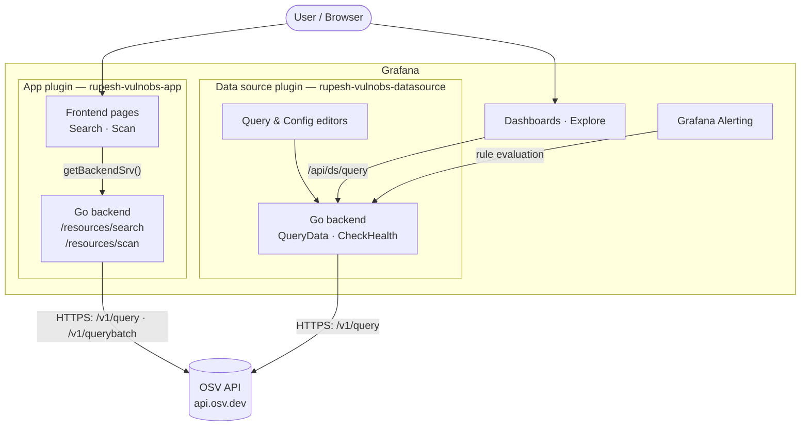

# Grafana Vulnerability Observability

[](https://github.com/rupeshkoushik07/grafana-vulnobs/actions/workflows/ci.yml)
[](./LICENSE)

Bring vulnerability observability into Grafana. Query public CVE feeds, browse the
vulnerabilities affecting your scanned containers and repositories, and alert natively
when new critical CVEs hit your stack — all alongside your existing metrics, logs, and traces.

> **Status:** early development · Phase 1 done, Phase 2 in progress · public data only. This project reads
> exclusively from public vulnerability feeds ([OSV](https://osv.dev),
> [NVD](https://nvd.nist.gov), [GitHub Advisory Database](https://github.com/advisories))
> and user-supplied scan output. It has no dependency on any private or internal system.

## Why

Security data usually lives in a separate tool from the metrics, logs, and traces teams
already watch in Grafana. This project closes that gap: a unified view where your
vulnerability posture sits next to the rest of your observability data, with Grafana's
native alerting on top.

## Architecture

Two plugins in one repo, built to grow in phases:

| Plugin | Directory | Role |
| --- | --- | --- |
| **Data source** (Go backend) | [`rupesh-vulnobs-datasource/`](./rupesh-vulnobs-datasource) | Queries public CVE feeds. Works in Explore, dashboards, and — because it has a backend — **Grafana alert rules**. This is the Phase 1 focus. |
| **App** | [`rupesh-vulnobs-app/`](./rupesh-vulnobs-app) | Custom pages (**Search**, **Scan**) for searching CVEs and viewing the posture of a scanned image. Its Go backend calls OSV directly via resource endpoints. |

Only a backend **data source** can be used in Grafana Alerting, which is why the alertable
primitive lives there; the app is layered alongside for interactive browsing.



### Data flow

- **Search / Scan (app):** the React page calls the app's own Go backend over
  `getBackendSrv()` → `/api/plugins/rupesh-vulnobs-app/resources/{search,scan}`. The backend
  queries OSV live, parses the response, and returns rows. **Scan** additionally parses a
  Trivy/Grype report, extracts the package inventory, and matches every package against OSV —
  so results reflect vulnerabilities known *now*, not the scan's snapshot.
- **Dashboards / Alerting (data source):** panels and alert rules issue queries to the data
  source backend (`QueryData`), which calls OSV and returns Grafana **data frames**. Only this
  backend path can feed native alert rules.
- **No secrets required:** OSV needs no authentication. The optional API-key field is reserved
  for NVD / GitHub Advisory enrichment in a later phase and is stored in `secureJsonData`
  (backend-only, never sent to the browser).

## Roadmap

### Phase 1 — CVE query data source ✅
- ✅ Backend Go data source querying **OSV** (free, no auth)
- ✅ Query editor: pick ecosystem (npm, Go, PyPI, Maven, …) + package (+ optional version), or a CVE / GHSA id
- ✅ Returns a table of vulnerabilities: id, cve, severity, cvss, summary, fixed version, references
- ✅ Health check + config editor (OSV URL, optional NVD / GitHub API keys)

### Phase 2 — App, asset inventory & matching ✅
- ✅ **Search** page — query OSV live by package or CVE id, with severity summary + click-to-filter
- ✅ **Scan** page — upload a **Trivy / Grype / CycloneDX / SPDX** report, extract its package inventory
  (purl-aware, incl. Debian/Alpine OS packages), and match every package against live OSV — results
  reflect vulnerabilities known *now*, not the scan's snapshot
- ✅ Provisioned demo dashboard + data source instance
- ⏳ NVD and GitHub Advisory as enrichment feeds

### Phase 3 — Alerting & intelligence
- Native Grafana alert rules on new critical CVEs affecting your assets
- Scheduled feed sync
- Optional "explain / remediate this CVE" via the Grafana LLM app

### Phase 4 — Correlation & visualization
- Integrate with **Loki**: ship vulnerability findings as structured log streams so they're
  queryable and alertable alongside application logs/traces
- Custom **panel plugin** (`rupesh-vulnobs-panel`) to visualize vulnerability posture (severity
  timeline / heatmap)
- Advanced query editor (LogQL-aware builder) and provisioned alert rules
- Technical write-up of the design decisions for Grafana users

### Phase 5 — Front-end architecture & quality
- Refactor the app UI into a well-structured React/TS layer: reusable hooks, a clear state
  boundary (**React Query** for server state + local UI state)
- **Storybook** stories for the shared components
- Broaden **Jest + React Testing Library** coverage

## Development

Prerequisites: Node.js, Go, [mage](https://magefile.org), and Docker.

```bash
# Data source (Phase 1)
cd rupesh-vulnobs-datasource
npm install
npm run dev                    # build + watch the frontend
mage -v build:darwinARM64      # build the Go backend (use your target arch)
docker compose up              # start Grafana at http://localhost:3000
```

Each plugin is a standard [`@grafana/create-plugin`](https://grafana.com/developers/plugin-tools)
project — see its own `README.md` for details.

## Contributing

Contributions welcome once Phase 1 lands. Adding a new feed source is designed to be a
clean, self-contained extension point — a good first contribution.

## License

[Apache-2.0](./LICENSE)
