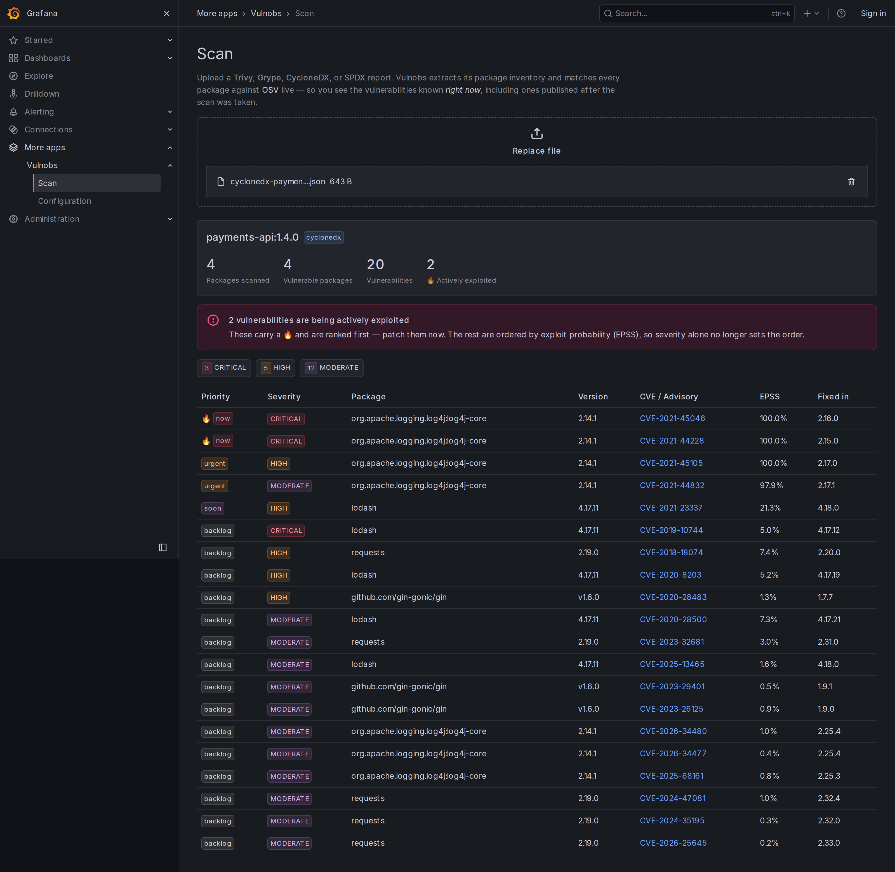
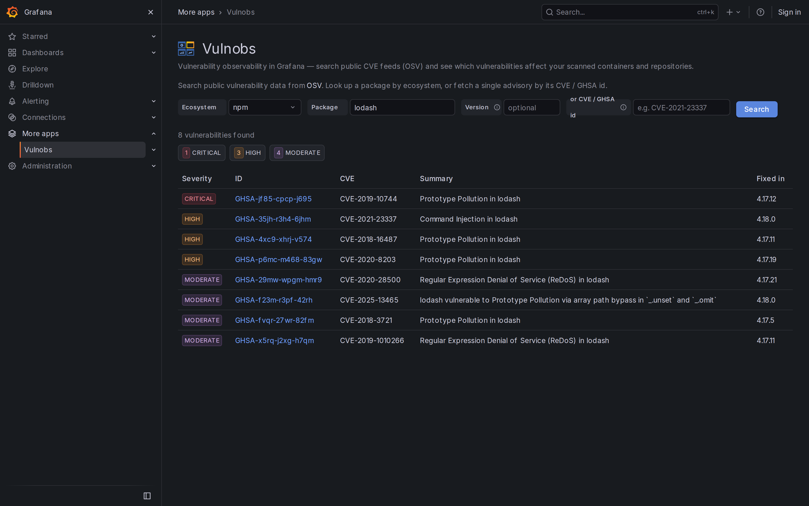
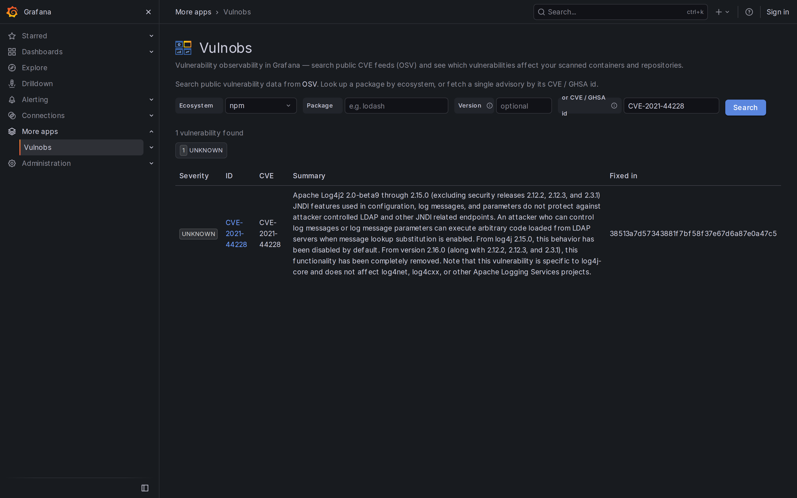
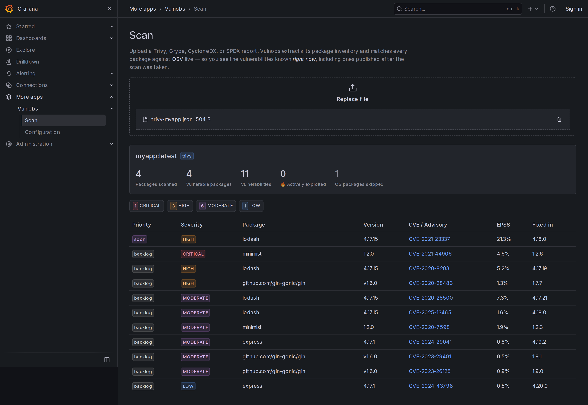
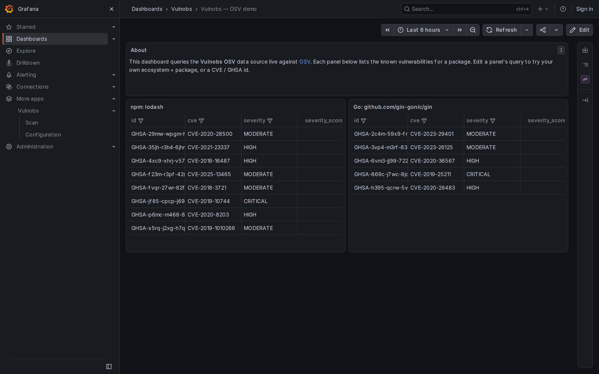
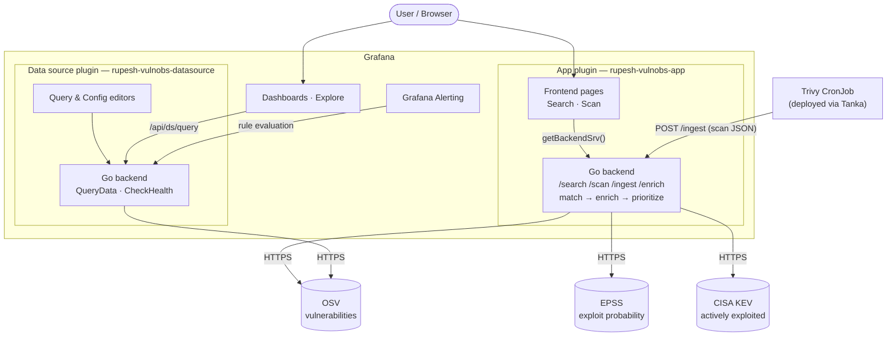

# Grafana Vulnerability Observability

[](https://github.com/rupeshkoushik07/grafana-vulnobs/actions/workflows/ci.yml)
[](./LICENSE)

Bring vulnerability observability into Grafana. Query public CVE feeds, browse the
vulnerabilities affecting your scanned containers and repositories, and alert natively
when new critical CVEs hit your stack — all alongside your existing metrics, logs, and traces.

> **Status:** early development · public data only. This project reads
> exclusively from public vulnerability feeds ([OSV](https://osv.dev),
> [NVD](https://nvd.nist.gov), [GitHub Advisory Database](https://github.com/advisories))
> and user-supplied scan output. It has no dependency on any private or internal system.

## Quick start

Run Grafana with both plugins, the OSV data source and a demo dashboard already set up:

```bash
docker run --rm -p 3000:3000 ghcr.io/rupeshkoushik07/grafana-vulnobs:main
```

Open http://localhost:3000, log in as `admin` / `admin`, then go to **More apps → Vulnobs**.
Sample reports to upload on the Scan page are in [`examples/`](./examples). The image is
signed; see [Verify an image](#verify-an-image).

## Screenshots

**Scan:** upload a Trivy, Grype, CycloneDX or SPDX report. Every package is matched against
live OSV, and findings are ranked by CISA KEV and EPSS, so actively exploited CVEs come first.



<details>
<summary>More screenshots</summary>

**Search** a package across OSV:



**Look up** a single advisory by CVE or GHSA id:



**Scan** a Trivy report (OS packages are skipped):



**Dashboard** panels backed by the data source:



</details>

## Why

Security data usually lives in a separate tool from the metrics, logs, and traces teams
already watch in Grafana. This project closes that gap: a unified view where your
vulnerability posture sits next to the rest of your observability data, with Grafana's
native alerting on top.

## Architecture

Two plugins in one repo:

| Plugin | Directory | Role |
| --- | --- | --- |
| **Data source** (Go backend) | [`rupesh-vulnobs-datasource/`](./rupesh-vulnobs-datasource) | Queries public CVE feeds. Works in Explore, dashboards, and — because it has a backend — **Grafana alert rules**. |
| **App** | [`rupesh-vulnobs-app/`](./rupesh-vulnobs-app) | Custom pages (**Search**, **Scan**). Its Go backend matches packages against OSV **and enriches every CVE with EPSS + CISA KEV** to rank findings by real risk. Accepts pushed scans on `/ingest`. |

Only a backend **data source** can be used in Grafana Alerting, which is why the alertable
primitive lives there; the app is layered alongside for interactive browsing and prioritization.



### Data flow

- **Search / Scan (app):** the React page calls the app's own Go backend over
  `getBackendSrv()` → `/resources/{search,scan}`. The backend queries OSV live and, for Scan,
  parses a **Trivy / Grype / CycloneDX / SPDX** report, extracts the package inventory, and
  matches every package against OSV — so results reflect vulnerabilities known *now*, not the
  scan's snapshot.
- **Enrichment & prioritization (app):** every CVE is enriched with **EPSS** (exploit
  probability) and **CISA KEV** (actively exploited) and given a priority score
  (`KEV > EPSS > severity`), so a CRITICAL-but-unexploited CVE can rank *below* a
  MODERATE-but-exploited one. `/enrich` exposes this engine on its own.
- **Continuous ingest:** an external scanner (a Trivy CronJob, deployed via
  [Tanka](./deploy/tanka)) pushes reports to `/ingest`, which stores the latest prioritized
  posture per asset — turning manual uploads into continuous monitoring.
- **Dashboards / Alerting (data source):** panels and alert rules issue queries to the data
  source backend (`QueryData`), which calls OSV and returns Grafana **data frames**. Only this
  backend path can feed native alert rules.
- **No secrets required:** OSV, EPSS, and KEV are all free public feeds needing no
  authentication.

## Development

Prerequisites: Node.js, Go, [mage](https://magefile.org), and Docker.

```bash
# Data source
cd rupesh-vulnobs-datasource
npm install
npm run dev                    # build + watch the frontend
mage -v build:darwinARM64      # build the Go backend (use your target arch)
docker compose up              # start Grafana at http://localhost:3000
```

Each plugin is a standard [`@grafana/create-plugin`](https://grafana.com/developers/plugin-tools)
project — see its own `README.md` for details.

## Deploy to Kubernetes (Tanka)

A [Grafana Tanka](https://tanka.dev) environment in [`deploy/tanka/`](./deploy/tanka) deploys
the whole stack to a cluster — the signed Vulnobs Grafana image, plus a Trivy CronJob that
continuously scans an image and pushes results to the app's `/ingest` endpoint. It can also
render a Kyverno policy that refuses to run the image unless its signature verifies.

```bash
cd deploy/tanka
tk show environments/default                                  # render the manifests
tk env set environments/default --server=https://<api>:6443   # target your cluster
tk apply environments/default                                 # diff, then apply
```

## Supply chain

Every push to `main` and every `v*` tag runs [`image.yml`](./.github/workflows/image.yml),
which publishes `ghcr.io/rupeshkoushik07/grafana-vulnobs`: Grafana with both plugins baked in,
for `linux/amd64` and `linux/arm64`.

1. **Build the plugins** (frontend and Go backend) inside Docker.
2. **Gate:** Trivy scans the plugin files and fails the run on any fixable HIGH or CRITICAL
   vulnerability. This happens *before* anything is pushed.
3. **Build and push** the image on a digest-pinned Grafana base.
4. **SBOM:** Trivy generates a CycloneDX SBOM of the full image (`linux/amd64`). Findings in
   the Grafana base image are listed in the run summary but don't fail the build, since
   they can't be fixed in this repo.
5. **Sign** the image by digest with cosign keyless signing: GitHub's OIDC token gets a
   short-lived Sigstore certificate bound to this workflow, and the signature is recorded in
   the public Rekor transparency log. There is no private key to manage or leak.
6. **Attest** the SBOM to the same digest as a signed attestation.

Dependencies are pinned at every layer: Go modules by `go.sum` (CI builds with
`GOFLAGS=-mod=readonly`), npm packages by `package-lock.json` with `npm ci`, base images by
digest, and every GitHub Action by full commit SHA. Dependabot keeps all four current, with
a 5-day cooldown on new releases.

### Verify an image

You need [cosign](https://docs.sigstore.dev/cosign/system_config/installation/) v3. Take the
digest from the workflow run summary, or look it up:

```bash
docker buildx imagetools inspect ghcr.io/rupeshkoushik07/grafana-vulnobs:main
```

Check the signature:

```bash
cosign verify \
  --certificate-identity-regexp '^https://github\.com/rupeshkoushik07/grafana-vulnobs/\.github/workflows/image\.yml@refs/(heads/main|tags/v.+)$' \
  --certificate-oidc-issuer https://token.actions.githubusercontent.com \
  ghcr.io/rupeshkoushik07/grafana-vulnobs@sha256:<digest>
```

Check the SBOM attestation:

```bash
cosign verify-attestation \
  --type cyclonedx \
  --certificate-identity-regexp '^https://github\.com/rupeshkoushik07/grafana-vulnobs/\.github/workflows/image\.yml@refs/(heads/main|tags/v.+)$' \
  --certificate-oidc-issuer https://token.actions.githubusercontent.com \
  ghcr.io/rupeshkoushik07/grafana-vulnobs@sha256:<digest>
```

The identity is pinned to this repo's `image.yml` running on `main` or a release tag, so a
signature made by any other repo, workflow or branch fails verification.

To enforce this at admission time, set `verifyImageSignatures: true` in the
[Tanka environment](./deploy/tanka#enforce-signed-images-kyverno).

## Contributing

Contributions welcome. Adding a new feed source is designed to be a clean, self-contained
extension point — a good first contribution.

## License

[Apache-2.0](./LICENSE)
