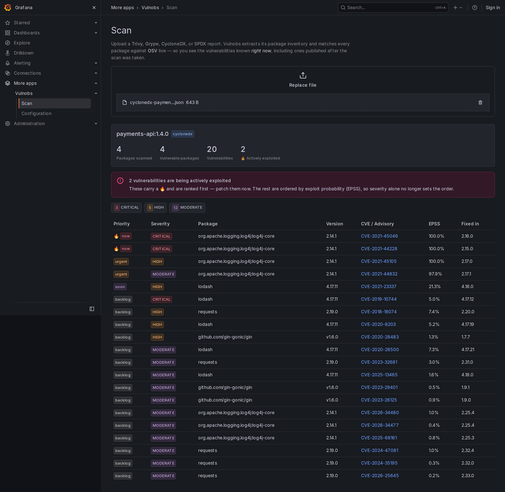
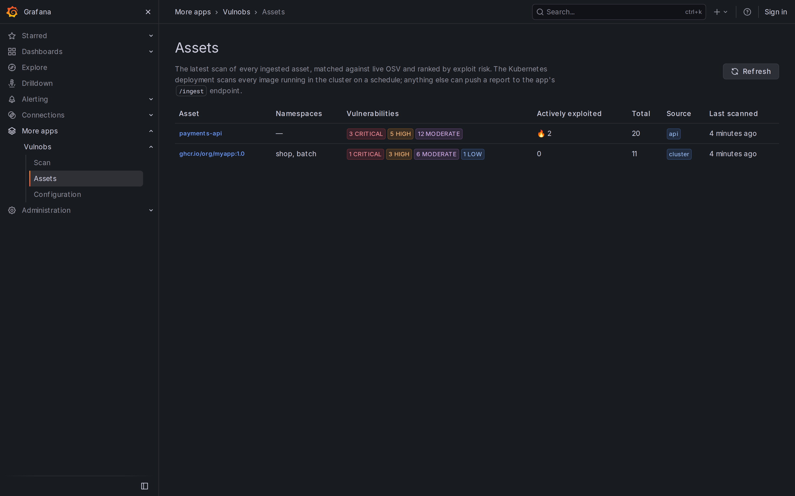
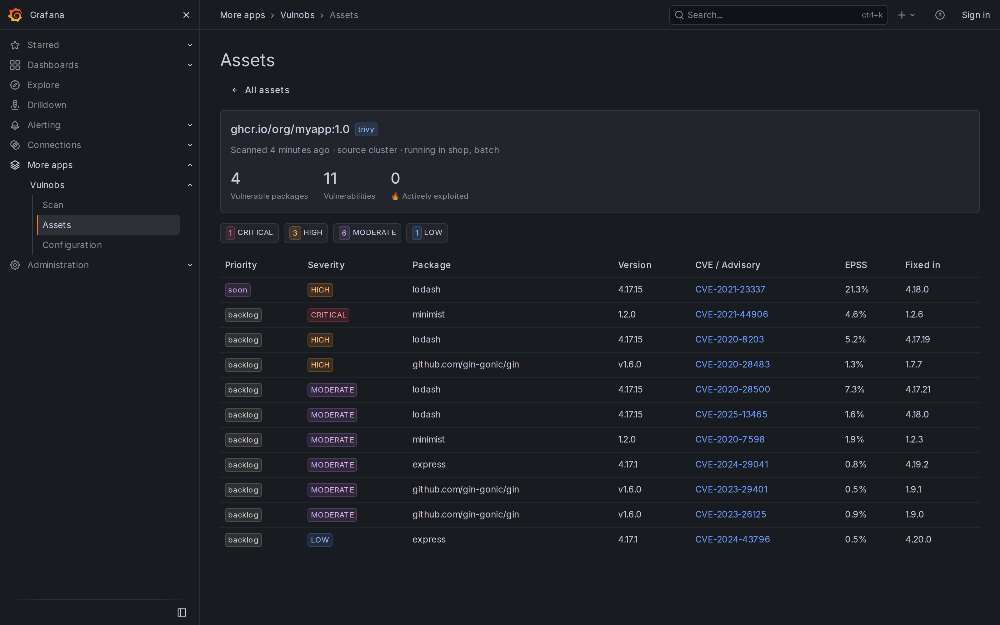
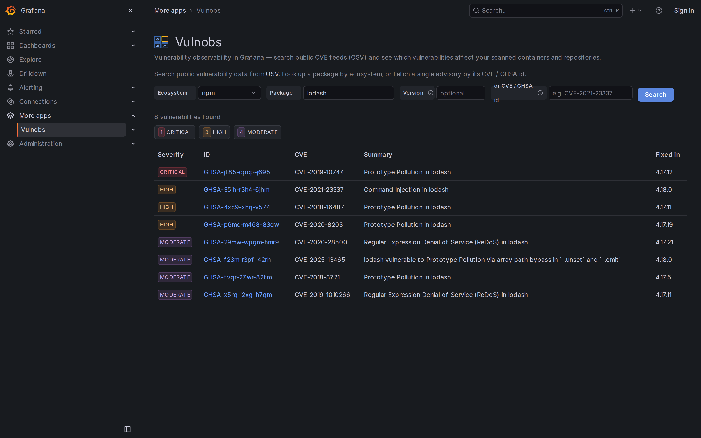
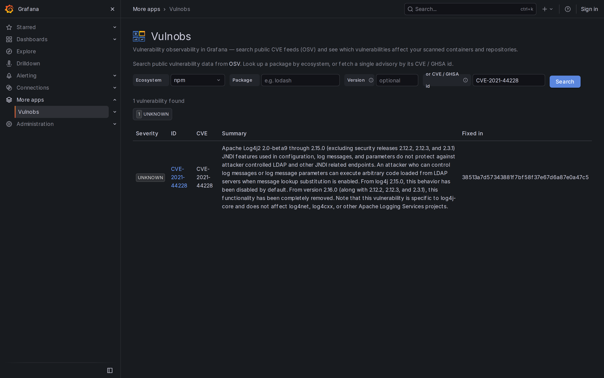
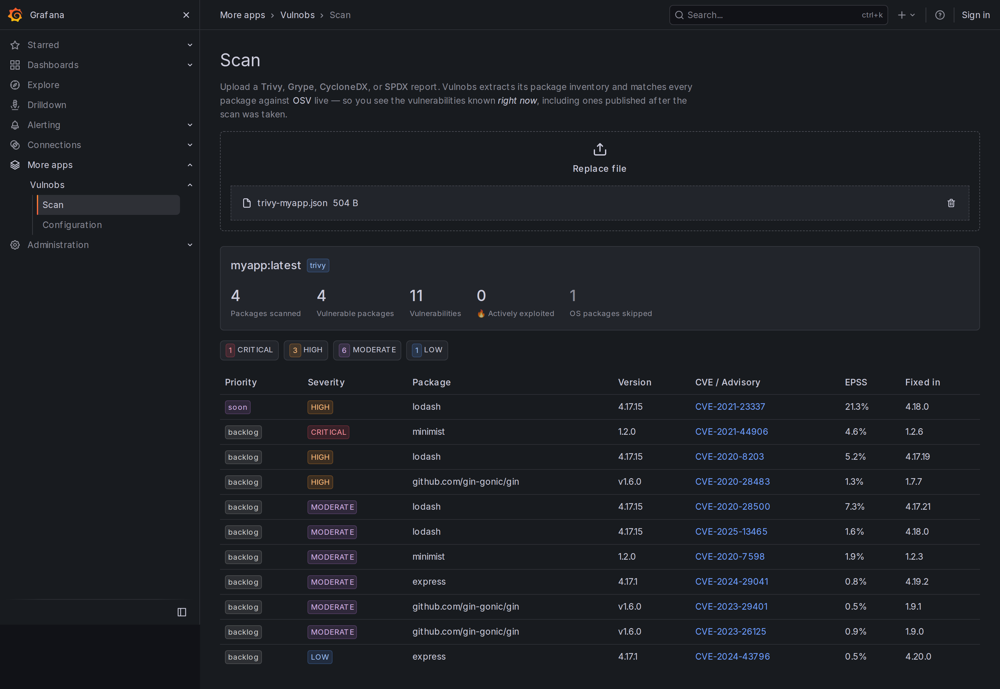
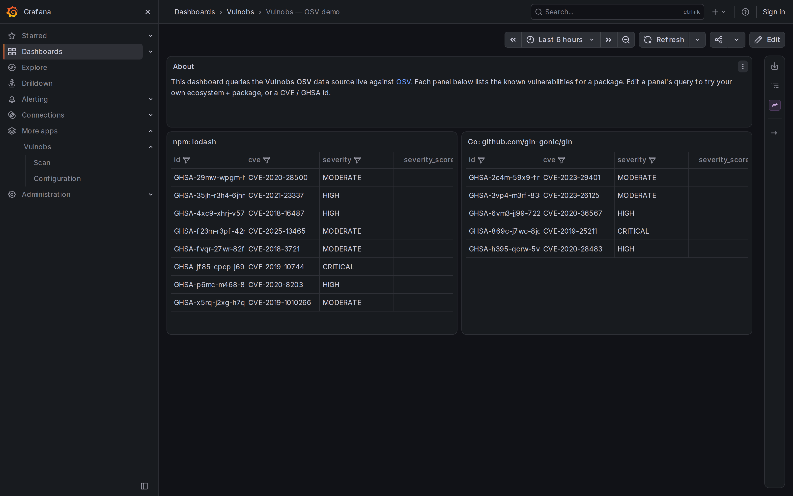
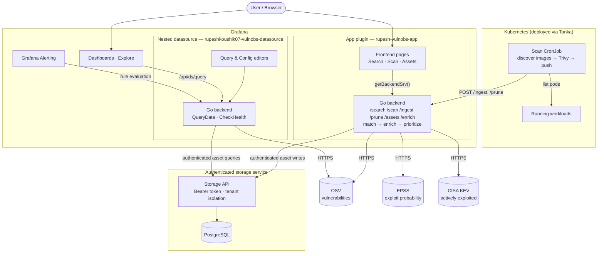

# Grafana Vulnerability Observability

[](https://github.com/rupeshkoushik07/grafana-vulnobs/actions/workflows/ci.yml)
[](./LICENSE)

Bring vulnerability observability into Grafana. Query public CVE feeds, see the
vulnerabilities in every image running in your cluster ranked by exploit risk, and alert
natively when an actively exploited vulnerability shows up — all alongside your existing
metrics, logs, and traces.

> **Status:** early development · public data only. This project reads
> exclusively from public vulnerability feeds ([OSV](https://osv.dev),
> [NVD](https://nvd.nist.gov), [GitHub Advisory Database](https://github.com/advisories))
> and user-supplied scan output. It has no dependency on any private or internal system.

## Quick start

For local development, run Grafana with the Vulnobs app (including its nested OSV data
source), a demo dashboard, an alert rule, and the PostgreSQL-backed storage API. The image
is built for `linux/amd64` and `linux/arm64`, so it runs natively on Intel and Apple Silicon
machines. The storage API requires PostgreSQL; the Grafana image alone is not a complete
installation.

```bash
git clone https://github.com/rupeshkoushik07/grafana-vulnobs.git
cd grafana-vulnobs/rupesh-vulnobs-app
npm ci
npm run build
mage -v build:linux
cd ../rupesh-vulnobs-datasource
mage -v build:linux
cp dist/gpx_vulnobs_linux_amd64 ../rupesh-vulnobs-app/dist/datasource/
cd ../rupesh-vulnobs-app
docker compose up --build
```

Once the logs settle (10–20 seconds):

1. Open http://localhost:3000 and log in as `admin` / `admin` (you can skip the prompt to
   change the password).
2. Go to **More apps → Vulnobs → Scan** and upload a sample report from
   [`examples/`](./examples), such as `cyclonedx-payments-api.json`. Every package is matched
   against live OSV and ranked by exploit risk.
3. Use **Search** to look up a package or a CVE / GHSA id.
4. Push a report the way a scanner would, then open **More apps → Vulnobs → Assets**:

   ```bash
   curl -u admin:admin -X POST "http://localhost:3000/api/plugins/rupeshkoushik07-vulnobs-app/resources/ingest?asset=payments-api" \
     -H "Content-Type: application/json" --data-binary @examples/cyclonedx-payments-api.json
   ```

   Within a minute, **Alerting → Alert rules → Vulnobs** fires for it: it has two actively
   exploited vulnerabilities.
5. Open **Dashboards → Vulnobs → Vulnobs — OSV demo** to see the data source in dashboard
   panels.

Press Ctrl+C to stop. Pushed scans persist in the Compose PostgreSQL volume and are
available after Grafana restarts. Reports uploaded on the Scan page are not stored.

- **Port 3000 already in use:** map another port, e.g. `-p 3001:3000`, and open
  http://localhost:3001.
- **Start from scratch:** stop Compose and remove its PostgreSQL volume with
  `docker compose down --volumes` (this deletes ingested scan data).
- **Check what you're running:** the image is signed by this repo's pipeline; see
  [Verify an image](#verify-an-image).

## Screenshots

**Scan:** upload a Trivy, Grype, CycloneDX or SPDX report. Every package is matched against
live OSV, and findings are ranked by CISA KEV and EPSS, so actively exploited CVEs come first.



<details>
<summary>More screenshots</summary>

**Assets:** the latest scan of every image running in the cluster (and anything else pushed
to `/ingest`), most urgent first:



**An asset**, with the namespaces running it and its findings ranked by exploit risk:



**Search** a package across OSV:



**Look up** a single advisory by CVE or GHSA id:



**Scan** a Trivy report (OS packages are skipped):



**Dashboard** panels backed by the data source:



</details>

## Why

Security data usually lives in a separate tool from the metrics, logs, and traces teams
already watch in Grafana. This project closes that gap: a unified view where your
vulnerability posture sits next to the rest of your observability data, with Grafana's
native alerting on top.

## Architecture

One installable app bundles the app experience and the native Grafana data source. The
standalone data source project remains in the repository for the v0.4.0 fallback:

| Plugin | Directory | Role |
| --- | --- | --- |
| **Vulnobs App** | [`rupesh-vulnobs-app/`](./rupesh-vulnobs-app) | Custom pages (**Search**, **Scan**, **Assets**), ingestion and CVE enrichment. Its package bundles the nested datasource frontend and backend. |
| **Nested Vulnobs OSV datasource** | [`rupesh-vulnobs-app/src/datasource/`](./rupesh-vulnobs-app/src/datasource) | Native Grafana datasource for Explore, dashboards, and alert rules. Keeps its existing datasource ID so saved dashboards and alert rules continue to resolve. |

The datasource remains a native backend **data source**, even though it is now distributed
inside the app package. Grafana Alerting, Explore and dashboard queries continue to use that
datasource interface; the app backend remains responsible for scans and enrichment.


```mermaid
flowchart TB
    user(["User&nbsp;/&nbsp;Browser"])

    subgraph k8s["Kubernetes (deployed via Tanka)"]
        direction TB
        pods["Running workloads"]
        scanner["Scan CronJob<br/>discover images → Trivy → push"]
        scanner -->|"list pods"| pods
    end

    subgraph grafana["Grafana"]
        direction TB
        dashes["Dashboards&nbsp;·&nbsp;Explore"]
        alerting["Grafana Alerting"]

        subgraph app["App plugin — rupesh-vulnobs-app"]
            direction TB
            appfe["Frontend pages<br/>Search · Scan · Assets"]
            appbe["Go backend<br/>/search /scan /ingest /prune /assets /enrich<br/>match → enrich → prioritize"]
            appfe -->|"getBackendSrv()"| appbe
        end

        subgraph ds["Nested datasource — rupeshkoushik07-vulnobs-datasource"]
            direction TB
            dsfe["Query &amp; Config editors"]
            dsbe["Go backend<br/>QueryData · CheckHealth"]
            dsfe --> dsbe
        end

    end

    subgraph storage["Authenticated storage service"]
        storageapi["Storage API<br/>Bearer token · tenant isolation"]
        postgres[("PostgreSQL")]
        storageapi --> postgres
    end

    osv[("OSV<br/>vulnerabilities")]
    epss[("EPSS<br/>exploit probability")]
    kev[("CISA KEV<br/>actively exploited")]

    user --> appfe
    user --> dashes
    scanner -->|"POST /ingest, /prune"| appbe
    appbe -->|"authenticated asset writes"| storageapi
    dsbe -->|"authenticated asset queries"| storageapi
    dashes -->|"/api/ds/query"| dsbe
    alerting -->|"rule evaluation"| dsbe
    appbe -->|"HTTPS"| osv
    appbe -->|"HTTPS"| epss
    appbe -->|"HTTPS"| kev
    dsbe -->|"HTTPS"| osv
```

### Data flow

- **Search / Scan (app):** the React page calls the app's own Go backend over
  `getBackendSrv()` → `/resources/{search,scan}`. The backend queries OSV live and, for Scan,
  parses a **Trivy / Grype / CycloneDX / SPDX** report, extracts the package inventory, and
  matches every package against OSV — so results reflect vulnerabilities known *now*, not the
  scan's snapshot.
- **Enrichment & prioritization (app):** every CVE is enriched with **EPSS** (exploit
  probability) and **CISA KEV** (actively exploited) and given a priority score
  (`KEV > EPSS > severity`), so a CRITICAL-but-unexploited CVE can rank *below* a
  MODERATE-but-exploited one. `/enrich` exposes this engine on its own.
- **Continuous cluster scanning:** a standalone scanner CronJob, deployed via [Tanka](./deploy/tanka), lists the
  images of every running pod through the Kubernetes API, scans each with Trivy, and pushes
  the reports to `/ingest` with the namespaces that run them. The app stores the latest
  prioritized posture per image in the authenticated storage API backed by PostgreSQL, so it
  survives Grafana restarts. `/prune` drops images that are no longer running. The **Assets**
  page shows the result. Anything else, such as a CI job, can push to `/ingest` too.
- **Dashboards / Alerting (data source):** panels and alert rules issue queries to the data
  source backend (`QueryData`), which returns Grafana **data frames**. A package or CVE query
  calls OSV. An **Ingested assets** query reads scans from the shared storage API and returns one row
  per asset with a single count (actively exploited, critical, high, …), which is the shape
  alert rules need. The image provisions a rule that fires for every asset with an actively
  exploited vulnerability.
- OSV, EPSS, and KEV are public feeds and need no credentials. The shared storage API uses a
  high-entropy bearer token stored in Grafana's `secureJsonData`; the App and datasource must
  use the same token.

## Development

Prerequisites: Node.js, Go, [mage](https://magefile.org), and Docker.

```bash
# App frontend includes the nested datasource frontend
cd rupesh-vulnobs-app
npm ci
npm run dev                    # build + watch both frontends
mage -v build:darwinARM64      # build the app backend

# The nested datasource backend is built from its standalone Go module and
# copied into app/dist/datasource for local packaging.
cd ../rupesh-vulnobs-datasource
mage -v build:darwinARM64
cp dist/gpx_vulnobs_darwin_arm64 ../rupesh-vulnobs-app/dist/datasource/
cd ../rupesh-vulnobs-app
  docker compose up               # local setup instructions are in the app README
```

Each plugin is a standard [`@grafana/create-plugin`](https://grafana.com/developers/plugin-tools)
project — see its own `README.md` for details.

## Deploy to Kubernetes (Tanka)

A [Grafana Tanka](https://tanka.dev) environment in [`deploy/tanka/`](./deploy/tanka) deploys
the whole stack to a cluster: the signed Vulnobs Grafana image on a persistent volume, and a
CronJob that scans every image running in the cluster and feeds the Assets page and the alert
rule. The scan job's service account can only list pods. The environment can also render a
Kyverno policy that refuses to run the image unless its signature verifies.

Every pull request and push to `main` deploys this environment to a throwaway kind cluster
([`kubernetes.yml`](./.github/workflows/kubernetes.yml)) and checks the whole loop: the scan
finds a running workload's image, the result survives a Grafana restart, the data source and
alert rule read it, and the image is pruned once the workload is gone.

```bash
cd deploy/tanka
tk show environments/default                                  # render the manifests
tk env set environments/default --server=https://<api>:6443   # target your cluster
tk apply environments/default                                 # diff, then apply
```

## Supply chain

Every push to `main` and every `v*` tag runs [`image.yml`](./.github/workflows/image.yml),
which publishes `ghcr.io/rupeshkoushik07/grafana-vulnobs`: Grafana with the bundled Vulnobs app,
for `linux/amd64` and `linux/arm64`.

1. **Build what this repo ships** (the app and nested datasource frontends and Go backends, and the cluster
   scan helper) inside Docker.
2. **Gate:** Trivy scans those files and fails the run on any fixable HIGH or CRITICAL
   vulnerability. This happens *before* anything is pushed.
3. **Build and push** the image on a digest-pinned Grafana base.
4. **SBOM:** Trivy generates a CycloneDX SBOM of the full image (`linux/amd64`). Findings in
   the Grafana base image are listed in the run summary but don't fail the build, since
   they can't be fixed in this repo.
5. **Sign** the image by digest with cosign keyless signing: GitHub's OIDC token gets a
   short-lived Sigstore certificate bound to this workflow, and the signature is recorded in
   the public Rekor transparency log. There is no private key to manage or leak.
6. **Attest** the SBOM to the same digest as a signed attestation.

Dependencies are pinned at every layer: Go modules by `go.sum` (CI builds with
`GOFLAGS=-mod=readonly`), npm packages by `package-lock.json` with `npm ci`, base images by
digest, and every GitHub Action by full commit SHA. Dependabot keeps all four current, with
a 5-day cooldown on new releases.

### Verify an image

You need [cosign](https://docs.sigstore.dev/cosign/system_config/installation/) v3
(`brew install cosign` on macOS). Always verify by digest, never by tag: tags move, digests
don't.

Get the digest of the image you have. `docker pull` prints it on its `Digest:` line:

```bash
docker pull ghcr.io/rupeshkoushik07/grafana-vulnobs:main
```

You can also take it from the workflow run summary, or look it up without pulling:

```bash
docker buildx imagetools inspect ghcr.io/rupeshkoushik07/grafana-vulnobs:main
```

Check the signature:

```bash
cosign verify \
  --certificate-identity-regexp '^https://github\.com/rupeshkoushik07/grafana-vulnobs/\.github/workflows/image\.yml@refs/(heads/main|tags/v.+)$' \
  --certificate-oidc-issuer https://token.actions.githubusercontent.com \
  ghcr.io/rupeshkoushik07/grafana-vulnobs@sha256:<digest>
```

Check the SBOM attestation:

```bash
cosign verify-attestation \
  --type cyclonedx \
  --certificate-identity-regexp '^https://github\.com/rupeshkoushik07/grafana-vulnobs/\.github/workflows/image\.yml@refs/(heads/main|tags/v.+)$' \
  --certificate-oidc-issuer https://token.actions.githubusercontent.com \
  ghcr.io/rupeshkoushik07/grafana-vulnobs@sha256:<digest>
```

The identity is pinned to this repo's `image.yml` running on `main` or a release tag, so a
signature made by any other repo, workflow or branch fails verification.

To enforce this at admission time, set `verifyImageSignatures: true` in the
[Tanka environment](./deploy/tanka#enforce-signed-images-kyverno).

## Contributing

Contributions welcome. Adding a new feed source is designed to be a clean, self-contained
extension point — a good first contribution.

## License

[Apache-2.0](./LICENSE)
